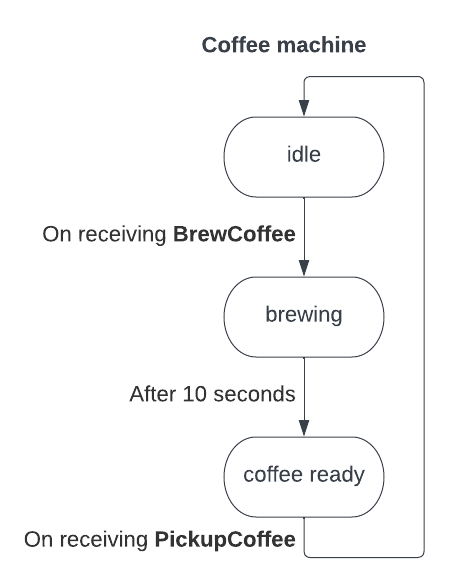

# Exercise - Coffee Machine - Functional-Oriented Style

## Objective

Implement the `CoffeeMachine` actor using the functional-oriented style.

- **CoffeeMachine** is a finite state machine. The functional-oriented style is generally good at implementing a finite state machine.
  
  

- Each state (idle, brewing, coffee ready) is defined as a distinct behavior in the actor.

- Each time a state is completed, we move to the next behavior.
  - Initial state is **idle**, machine is ready to brew.
  - On receiving **BrewCoffee** message, handle it.
  - After 10 seconds, move to **coffee ready** state.
  - On receiving **PickupCoffee** message (Barista picks up the coffee), move back to the initial state **idle**.

## Instructions

- In **CoffeeMachine.java**, the function definitions of the 3 behaviors representing the 3 states (idle, brewing, coffee ready) are already present. Implement the transitions between the behaviors.

- Replace `???` with your implementations as part of the exercise.

- There are unit tests that validate your solution. You can run the tests using sbt: `sbt clean test`.

## Solution

- After you have attempted the exercise, you can view the solution by navigating to the `akka-basics-for-scala/solutions/scala/002_coffee_machine` directory.
